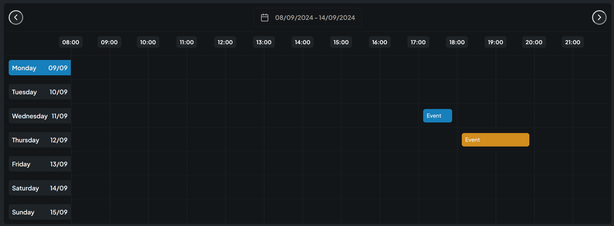

# React Event Calendar

Event calendar React component. A basic week timeline event calendar.



## Note

The calendar use 24h mode, and default format is `DD/MM/YYYY`. In later updates there will be configurable formats and time mode.

## Demo

You will find a demo here: [Demo Page](https://react-event-calendar.pages.dev)

## Use

Call the component:

```ts
<EventCalendar values={events} />
```

### Props

The component's props `type EventCalendarProps`:

```ts
interface EventCalendarProps {
  config?: {
    initialDate?: Date;
    hoursPerDay?: number;
    hoursStart?: number;
    daysCount?: number;
  };
  values: EventCalendarDate[];
  onEventSelect?: (id: string) => void;
}
```

| prop               | type                | description                                                                                   |
| ------------------ | ------------------- | --------------------------------------------------------------------------------------------- |
| values             | EventCalendarDate[] | the events array                                                                              |
| config.initialDate | Date                | The initial week date. Set to current date by default.                                        |
| config.hoursPerDay | number              | The number of hours per day to display. Set to 14 by default.                                 |
| config.hoursStart  | number              | The starting hour of the calendar. set to 8 by default.                                       |
| config.daysCount   | number              | The number of days to display in the calendar, starting from Monday as 1. Set to 7 as default |
| onEventSelect      | callback            | A callback function returns the ID of the event when clicked                                  |

### Event Object

The Event object is the object to be displayed in the calendar.

```ts
interface EventCalendarDate {
  start: Date;
  end: Date;
  title: string;
  description?: string;
  status: AppointmentStatus; // "PENDING" | "CANCELED" | "SCHEDULED"
  id: string;
}
```

| prop        | type              | description                                                                    |
| ----------- | ----------------- | ------------------------------------------------------------------------------ |
| id          | string            | Unique ID                                                                      |
| start       | Date              | The event's start date                                                         |
| end         | Date              | The event's end date (Usually the same date as `start` bu only different hour) |
| title       | string            | The name of the event. Displayed in the calendar                               |
| description | string            | The description of the event, displayed in a tooltip                           |
| status      | AppointmentStatus | Status of the event. It affects the color of the event in the calendar         |
